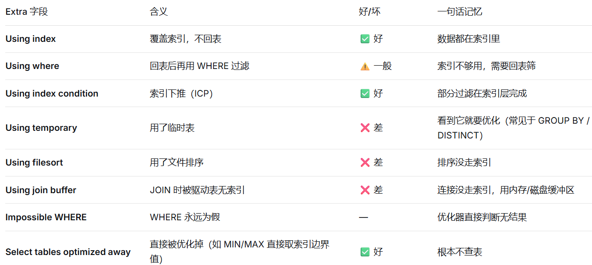
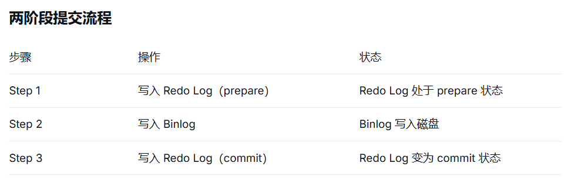
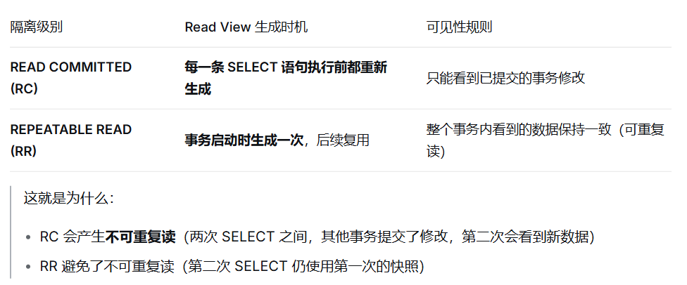
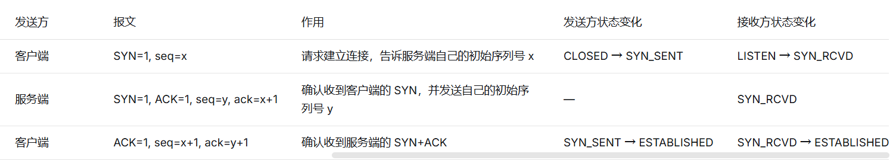
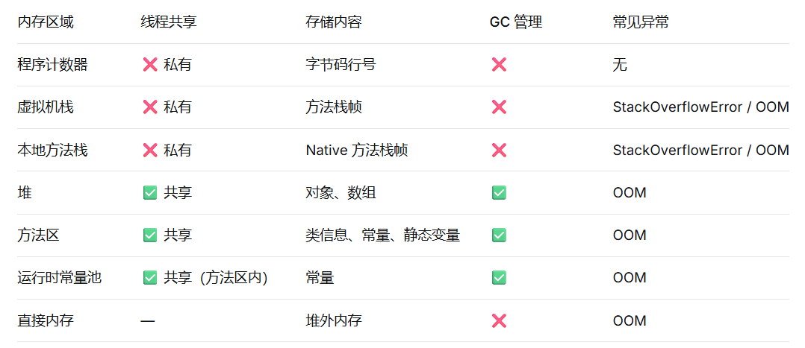
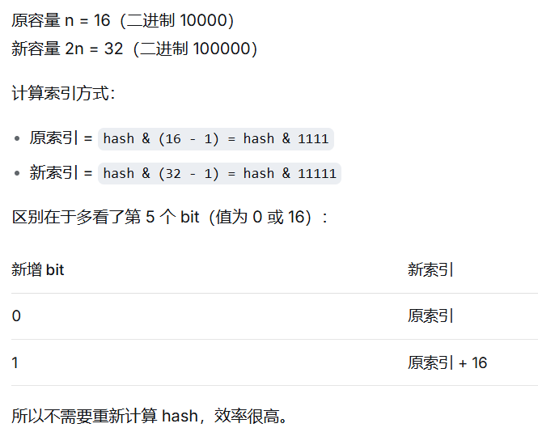

## 笔试

### 数据库

1. 表 t 结构为 (id INT PRIMARY KEY, age INT)。现有记录(1, 10), (5, 20), (10, 30)

    分析下面的事务执行，在 RR 隔离级别下，事务 A 会采取哪种方案？

    事务 A 执行：UPDATE t SET age = 21 WHERE id = 5;

    索引轴加锁方案：
    方案 1（普通索引）：锁定 (1, 5] 和 (5, 10)
    方案 2（唯一索引/主键）：只锁定 id = 5 这一行

    A 方案 1

    **B 方案 2**

    C 先执行方案 1，发现是主键后再降级为方案 2

    D 同时执行两个方案

---
相关知识：
- 隔离级别：Repeatable Read（RR），通过Gap Lock+Next-Key Lock 解决幻读（在同一个事务内，多次执行相同的查询语句，得到的结果集行数不一样）问题。
- 三种锁：
    - Record Lock（行锁）：锁住索引记录。
    - Gap Lock（间隙锁）：锁住索引记录之间的间隙，不锁数据本身。
    - Next-Key Lock（临键锁）：锁住索引记录和索引记录之间的间隙，锁范围：左开右闭区间 (a, b]。
    - exp: 
        数据：1，5，10
        临键锁区间：
        (-∞,1]、(1,5]、(5,10]、(10,+∞)

        如果命中 id=5：
        锁住 (1,5]，锁住 5 这行（记录锁）
        锁住 1~5 之间的空隙（间隙锁）→ 别人不能修改 5，也不能插入 2、3、4

    - Gap Lock 锁间隙，不让插入；Next-Key Lock = 锁行 + 锁间隙（默认）；**唯一索引 / 主键 等值命中 → 降级为单行记录锁**

2. 
    在 EXPLAIN 的 Extra 字段中，出现 Using index condition 代表：

    A 使用了覆盖索引

    **B 使用了索引下推（Index Condition Pushdown）优化**

    C 进行了全表扫描

    D 索引失效

---
相关知识：

3. 
    三个事务按顺序执行如下操作（表 t 有唯一索引 a，目前为空）：

    T1：INSERT INTO t(id, a) VALUES(1, 10); （正常执行）

    T2：INSERT INTO t(id, a) VALUES(2, 10); （阻塞，等待 S 锁）

    T3：INSERT INTO t(id, a) VALUES(3, 10); （阻塞，等待 S 锁）

    T1：ROLLBACK; （T1 回滚）

    结果：此时 T2 和 T3 之间会发生什么？

    A T2 执行成功，T3 继续等待

    B T2 和 T3 都会成功

    **C 产生死锁（Deadlock），MySQL 会回滚其中一个**

    D T2 和 T3 都会回滚

4. 下图展示了 MySQL 在更新一条记录时，Redo Log 和 Binlog 的写入逻辑。这是保证数据库崩溃恢复后“主从一致”的核心机制：

    Step 1：写入 Redo Log（prepare 状态）

    Step 2：写入 Binlog（写入磁盘）

    Step 3：写入 Redo Log（commit 状态）

    如果在 Step 2 执行完、Step 3 尚未执行时，数据库突然断电宕机，重启后该事务会如何处理？

    A 直接丢弃，因为事务没有完全提交

    B 依然提交，因为 Binlog 已经完整写入，可以保证主从数据一致

    C 报错并要求人工干预

    D 回滚，因为 Redo Log 还处于 prepare 状态

---
相关知识：
题目的核心机制是MySQL的**两阶段提交（2PC）**

MySQL 崩溃重启后，会对处于 prepare 状态的 Redo Log 事务进行检查：

判断规则：

- 如果 Binlog 完整写入（事务的 Binlog 存在且完整） → 提交该事务

- 如果 Binlog 不完整或不存在 → 回滚该事务

为什么这样设计？

- Binlog 完整：说明主库已经记录了该事务的变更。如果回滚，主库没有这条数据，但从库通过 Binlog 同步后却有这条数据，导致主从不一致。

- Binlog 不完整：说明事务尚未同步到 Binlog，主库回滚后，从库也不会看到，保持一致。

5. 
在 Repeatable Read（RR）级别下，事务 A 和事务 B 按如下时序执行（假设表 t 中初始没有 id=5 的数据）：

时间	事务 A（Transaction A）	事务 B（Transaction B）

T1	BEGIN；	BEGIN；

T2	SELECT * FROM t WHERE id=5；（空）	INSERT INTO t(id) VALUES(5)；

T3		COMMIT；

T4	UPDATE t SET name='X' WHERE id=5；	

T5	SELECT * FROM t WHERE id=5；（???）	

请问在 T5 时刻，事务 A 查询 id=5 的结果是：

A 依然为空（符合可重复读）

B 能够查到 id=5 的记录，且 name 为 'X'

C 事务 A 会在 T5 报错，提示“数据已存在”

D 事务 A 会在 T4 被阻塞，直到超时

---
相关知识：
在 RR 隔离级别下，快照读（普通 SELECT）与当前读（UPDATE / SELECT ... FOR UPDATE）使用不同的数据版本。事务的普通 SELECT 默认读取事务开始时的快照，但一旦事务内执行了当前读操作（如 UPDATE），就会读取最新的已提交数据，并且该事务后续的普通 SELECT 也会基于更新后的版本，从而“突破”可重复读的旧快照限制。

6. 读已提交（Read Committed）隔离级别下，Read View 的生成时机是：

A 事务启动时生成一次，后续复用

**B 每一条 SELECT 语句执行时都重新生成**

C 只有执行 CUD 操作时才生成

D 整个数据库生命周期只生成一次

---

### 计算机基础

1. 
    Java 反射机制不能实现的功能是（）

    A 在运行时判断对象所属的类

    **B 在运行时修改常量的值**

    C 在运行时构造类的对象

    D 在运行时调用私有方法

---
相关知识：
- A：通过 Object.getClass() 方法可以获取对象的运行时类，obj.getClass().getName() 可以得到类的全限定名。
- B: 常量通常用 static final 修饰，Java 编译时会进行常量折叠（Constant Folding），将常量的值直接内联到字节码中。
- C: 通过 Class.newInstance() 方法可以创建类的对象。
- D: 通过反射可以调用私有方法，通过 Method.setAccessible(true) 可以绕过 Java 的访问控制检查。

2.
    在 TCP 三次握手过程中，服务端收到客户端发送的 SYN 包并回复 SYN+ACK 后，服务端进入什么状态？

    A ESTABLISHED

    B SYN_SENT

    **C SYN_RCVD**
    
    D LISTEN

---
相关知识：

3. HashMap在JDK 1.8中，当链表长度超过8时，会将链表转换为红黑树。

4. 如何使用两个栈来实现浏览器的前进和后退功能？

    栈 A（后退栈）：记录用户访问过的页面历史。
    访问新页面时，当前页面压入栈 A。
    点击 “后退” 时，从栈 A 弹出页面，压入栈 B。

    栈 B（前进栈）：记录用户后退过的页面。
    点击 “前进” 时，从栈 B 弹出页面，压入栈 A。
    访问新页面时，栈 B 清空，保证前进路径唯一。

5. JVM的内存区域中，线程私有的部分是

    A. 堆  B. 方法区  C. 虚拟机栈  D. 直接内存

---
相关知识：

6. 关于 StringBuilder 和 StringBuffer 的区别，说法正确的是：

    A StringBuilder 是线程安全的，效率较低。

    B StringBuffer 是线程安全的，效率较低。

    C 两者都是不可变的。

    D 在单线程循环内拼接大量字符串，推荐使用 StringBuilder。
---
相关知识：
- StringBuilder 和 StringBuffer 都是用于拼接字符串的类，但 StringBuffer 是线程安全的，而 StringBuilder 不是。
- StringBuilder 和 StringBuffer 都是可变的，它们的方法不会创建新的对象，而是直接修改原对象。
- 在单线程循环内拼接大量字符串时，推荐使用 StringBuilder，因为它效率更高。

7. HashMap 在扩容（Resize）时，下列描述正确的是：

A 扩容后，每个元素在数组中的索引位置一定保持不变。

B 扩容后的容量是原来的 1.5 倍。

C 扩容过程涉及所有 key 的重新 Hash 计算。

D 扩容是为了减少 Hash 冲突带来的性能下降。

---
相关知识：
- HashMap 在扩容时，会将数组长度扩大为原来的两倍，并且重新计算每个元素在数组中的索引位置。因此，扩容后，每个元素在数组中的索引位置不一定保持不变。
- HashMap 的扩容容量是原来的两倍，而不是 1.5 倍，ArrayList是1.5倍。
- 扩容过程不需要重新计算 hash，只判断新增 bit。
- 扩容是为了解决 Hash 冲突带来的性能下降。

8. Java中

### 其他
- AI提示词的5C原则：
    - Character
    - Cause
    - Constraint
    - Contingency
    - Calibration
- example
    - “帮我重构这段300行的订单处理代码。”
    - 1. Character（角色）
        你是一位拥有10年经验的Java架构师，专注于领域驱动设计（DDD）和可测试性。

        2. Cause（原因）
            当前订单处理代码有以下问题（请基于这些原因进行重构）：

            一个方法内包含：参数校验、数据库查询、折扣计算、库存扣减、邮件发送、日志记录。

            单元测试几乎无法写（mock依赖过多）。

            新增一种支付方式需要修改核心类（违反开闭原则）。

        3. Constraint（约束）
            不能改数据库表结构。

            不能引入新的消息队列或外部中间件。

            必须保持对外接口的签名不变。

            重构后代码行数不超过350行（可适度增加但不膨胀）。

        4. Contingency（条件 / 边界）
            如果某一步重构会导致性能下降超过10%（对比原代码的简单压测），请标明并提出替代方案。

            如果某些逻辑必须保持顺序执行（如先扣库存后扣款），请注明不能并发的部分。

        5. Calibration（校准 / 验证）
            重构后请提供：

            新代码的目录结构或类职责说明（几句话即可）。

            一个单元测试示例（仅针对折扣计算逻辑）。

            指出哪里体现了单一职责原则。

            对比原代码：可维护性提升的具体表现（3个要点）。

### 算法题

1. [腐烂橘子](https://leetcode.cn/problems/rotting-oranges/description/?envType=study-plan-v2&envId=top-100-liked)

2. [课程表](https://leetcode.cn/problems/course-schedule-iii/description/)

