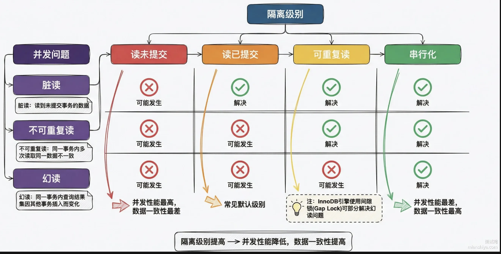
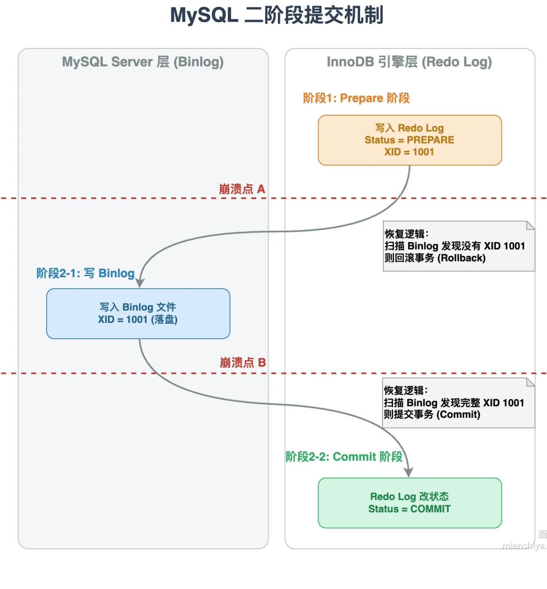
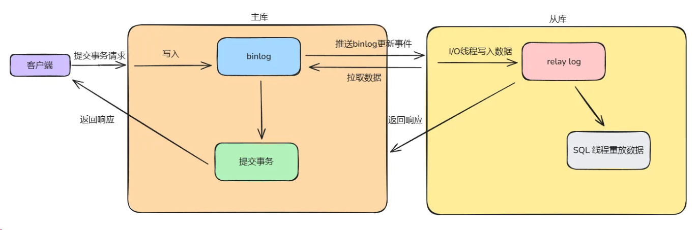
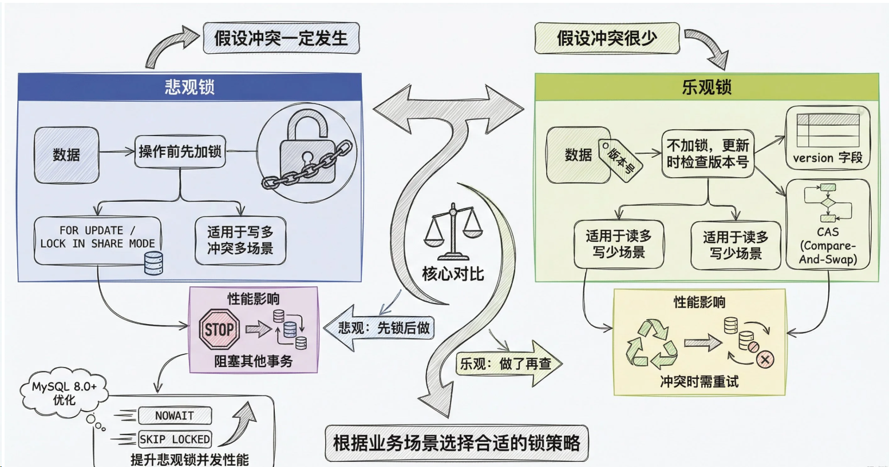

## 数据库的脏读、不可重复读、幻读分别是什么问题？
- 脏读：一个事务读取了另一个事务未提交的数据
- 不可重复读：一个事务在读取数据后，另一个事务修改了数据，导致第一个事务读取到的数据不一致
- 幻读：一个事务在读取数据后，另一个事务插入了数据，导致第一个事务读取到的数据不一致（强调数据量大变化）

## 数据库的四大隔离级别
1. 读未提交（Read Uncommitted）
  - 别人还没提交的事务，你都能读到
  - 会读到脏数据（别人修改了又回滚了）
2. 读已提交（Read Committed） **这是Oracle、SQL Server默认的隔离级别**
  - 只能读到别人已经提交的数据
  - 解决了脏读问题
  - 但是会读到不可重复读的问题（同一条 SQL，两次读结果不一样（因为中间别人改了并提交了））
3. 可重复读（Repeatable Read） **这是MySQL默认的隔离级别**
  - 解决了不可重复读问题
  - 但是会读到幻读的问题（同一条 SQL，两次读结果不一样（因为中间别人插入了数据））
4. 串行化（Serializable）
  - 解决了幻读问题
  - 但是性能会非常差

## Mysql事务的二阶段提交是什么？
Mysql的二阶段提交是为了解决Servcer层和引擎层的事务一致性问题
整个过程分为两步来走：
1. prepare阶段
  - 事务提交时候，InnoDB先将修改写入redo log中，其状态标志为Prepared，表示我准备好了，但是还没有提交
2. commit阶段
  - redo log写完，Server层把操作写入bin log中，bin log落盘成功，再通知InnoDB把redo log中的状态改为commit，整个事务才算提交完成。
  

## 什么是Mysql中的主从同步机制？它是如何实现的？
Mysql的主从同步的核心是binlog复制，主库把写日志写到binlog日志中，从库拉过来执行一遍就实现了主从同步。主要涉及到三个线程之间的配合。
- 主库的dump线程，监听binlog变更，有新内容就推送到从库
- 从库的I/O线程，拉取主库数据，把收到的binlog写道本地的relaylog
- 从库的SQL线程，负责从relay log中读取，逐条执行sql语句

## 如何处理Mysql的主从同步延迟？
**主从延迟**是必然存在的，是不可避免的，只能尽量缩短延迟时间或在业务层面做规避。
业务层面的常见处理方案：
1. 关键业务强制走主库，比如注册完后登录的逻辑，这类操作的频次不高，对主库的压力有限。
2. 延迟感知。 写操作后记录时间戳，短时间内的读请求走主库，过了延迟时间再走从库（可以使用ThreadLocal来实现延迟感知,或者使用Redis来实现延迟感知）
3. 二次查询兜底。从库查不到就去主库查。（但是会增加主库的压力，可以作为攻击手段）
4. 缓存前置。写入主库的同时写入缓存，不过又引入了缓存一致性问题，属于用一个问题换另外一个问题。

## Mysql中的长事务会导致什么问题？

## Mysql的乐观锁和悲观锁是什么？
### 主要的行级锁
在 MySQL 中，排他锁（X 锁）和共享锁（S 锁）是行级锁的核心类型（InnoDB 引擎支持），用于控制多事务并发访问数据时的一致性和隔离性。
- 共享锁（Shared Lock，S 锁）：相当于给文件加 “只读锁”，多个用户都能加这个锁，只能读不能改。
- 排他锁（Exclusive Lock，X 锁）：相当于给文件加 “独占锁”，只有一个用户能加这个锁，既可以读也可以改，其他人既不能改也不能加排他锁。

### 乐观锁和悲观锁
> 乐观锁和悲观锁是两种并发控制思想，本质区别在于对冲突的预期态度不同。
- 乐观锁：假设冲突不存在，不会加锁，只在提交时检查是否有冲突。通常使用版本号来实现，读的时候把version一起读出来，更新的时候判断version是否一致。
- 悲观锁：假设冲突存在，会加锁，其他事务不能并发访问数据。

## Mysql中有哪些锁类型？
Mysql InnoDB的锁可以从两个维度来区分：粒度和模式。
- 粒度：锁的范围，分为行级锁和表级锁。
- 模式：锁的类型，分为共享锁和排他锁。
### 行级锁
- 记录锁（Record Lock）：对表中的行进行加锁，只能对这行数据进行读写操作，其他事务不能对这行数据进行读写操作。
- 间隙锁（Gap Lock）：对表中的间隙进行加锁，防止其他事务插入数据到这个间隙中，从而避免幻读现象。
- 临键锁（Next-Key Lock）：记录锁和间隙锁的组合，对表中的记录和间隙进行加锁，防止其他事务插入数据到这个间隙中，从而避免幻读现象。
### 表级锁
表锁（Table Lock）：对整个表进行加锁，其他事务不能对表中的任何数据进行读写操作。