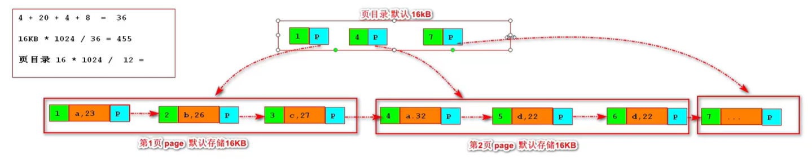
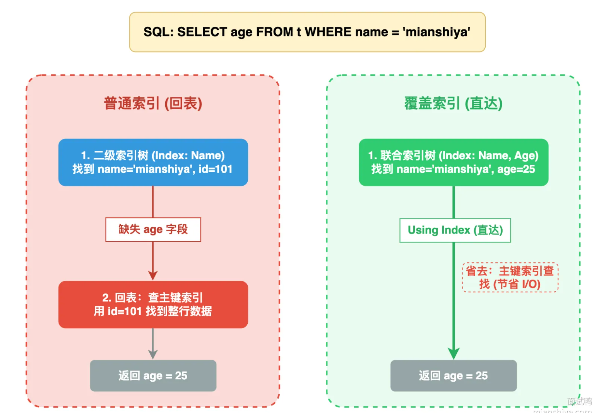

## 什么是索引？
> 一种帮助Mysql提高查询效率的数据结构

索引的优缺点：
- 优点：
  - 提高查询效率
- 缺点：
  - 占用额外的磁盘空间
  - 增加插入、更新和删除操作的成本（需要对索引进行维护）

## 索引的分类
- a.主键索引
  - 设置主键后会自动创建的索引（聚簇索引）
- b.单值索引（单列索引、普通索引）
  - 给表中的某个字段单独加一个索引（可有多个）


- c.唯一索引
  - 给表中的某个字段单独加一个索引（可有多个），索引值必须唯一（不允许重复），但允许有空值（NULL）。
  - InnoDB存储引擎中允许多个NULL，NULL代表未知，NULL！=NULL（与其他任何值都不相等）。

- d.组合索引
  - 给表中的多个字段组合起来加一个索引（只能有一个），用于提高多字段查询的效率。
- e.全文索引
  - 给表中的某个字段单独加一个索引（只能有一个），用于全文搜索。用于CHAR、VARCHAR、TEXT类型的字段。

  
## 索引的创建
- a.主键索引
  - 创建表时设置主键，会自动创建主键索引。
- b.单值索引
  - 建表时建立索引：
    ```sql
    CREATE TABLE table_name (
      column_name data_type primary key,
      INDEX index_name (column_name)
    );
    ```
  - 使用CREATE INDEX语句创建单值索引。
    ```sql
    CREATE INDEX index_name ON table_name (column_name);
    ```
- c.唯一索引
  - 建表时建立索引：
    ```sql
    CREATE TABLE table_name (
      column_name data_type unique,
      INDEX index_name (column_name)
    );
    ```
  - 使用CREATE UNIQUE INDEX语句创建唯一索引：
    ```sql
    CREATE UNIQUE INDEX index_name ON table_name (column_name);
    ```
- d.组合索引
  - 使用CREATE INDEX语句创建组合索引。
  - 左前缀索引：
    - 最佳左前缀原则
    - mysql引擎为了更好的利用索引，会动态调整查询字段顺序以利用索引
    ```sql
    <!-- 创建索引 -->
    CREATE INDEX idx_user ON user (country, city, age);
    <!-- 有限利用索引 -->
    SELECT * FROM user WHERE country = '中国' AND city = '北京' AND age = 18;
    <!-- 动态排序利用索引结构 -->
    SELECT * FROM user WHERE city = '北京' AND country = '中国';
    <!-- 缺少最左列，索引失效 -->
    SELECT * FROM user WHERE city = '北京';
    <!-- 中间断档查询，只能有效利用country索引，age列无法参与索引过滤 -->
    SELECT * FROM user WHERE country = '中国' AND age = 18;
    ```


- e.全文索引
  - 使用CREATE FULLTEXT INDEX语句创建全文索引。

## 索引的底层原理（B+树）

- B+树是一种自平衡的树形数据结构，它是一种多路搜索树，每个节点可以有多个子节点，但每个节点只有两个子节点时，称为二叉树。
- B+树的特点：
  - 所有叶子节点都在同一层，**叶子节点存储数据，非叶子节点存储索引**。
  - 非叶子节点中的索引指向叶子节点中的数据。
  - 非叶子节点中的索引按照升序排列，叶子节点中的数据按照升序排列。

  ## 聚簇索引和非聚簇索引
  - 聚簇索引：将数据存储与索引放到了一起，索引结构的叶子节点保存了行数据
  - 非聚簇索引：将数据与索引分开存储，索引结构的叶子节点保存的是指向实际数据的指针

  > 非聚簇索引一定是二次查找

  **为什么非聚簇索引存储的是主键值而不是实际的元素的位置**？
  - 当你插入、删除、更新数据，或表发生碎片整理（OPTIMIZE TABLE）时，数据行可能会被移动到磁盘的其他位置（比如页分裂、页合并）。
  - 如果非聚簇索引存的是物理位置：数据一移动，所有关联的非聚簇索引都要同步更新这个物理地址，维护成本极高，且极易出现索引和数据地址不匹配的错误（索引失效）。
  - 如果非聚簇索引存的是主键值：主键是唯一且稳定的（InnoDB 建议用自增主键，几乎不会修改），无论数据行的物理位置怎么变，主键值不变 → 非聚簇索引无需修改，天然保证索引的有效性。

  - **使用聚簇索引的优势**
    - 同一页会有多条行数据，访问同一数据页不同记录时，已经加载到Buffer中，再次访问时，会在内存中完成访问，不必访问磁盘。
    - 辅助素引的叶子节点，存储主键值，而不是数据的存放地址。好处是当行数据放生变化时，素引树的节点也需要分裂变化;或者是我们需要查找的进据，在上一次I0读写的内存中没有，需要发生一次新的操作时，可以避免对铺助素引的维护工作，只需要维护聚簇素引树就好了。另一个好处是，因为辅助素引存放的是主键值，减少了辅助素引占用的存储空间大小。
  - **使用聚簇索引的注意点**
    - 使用举聚簇索引的时候最好不用uuid，因为uuid的值是随机值，在插入的时候，为了维护B+树的特性，可能会造成页分裂，页合并，影响性能。
    - 使用聚簇索引的时候最好使用自增的id，因为自增的id是顺序的，对索引树的维护成本较低。


## 什么情况下不会使用索引
- Like关键字以%开头不会使用索引
- 多列索引遵循最左匹配原则
- 使用OR关键字时，左右有一个不是索引，在查询时将不会使用索引

## 什么是mysql的覆盖索引
- 覆盖索引：指的是查询语句中使用的索引，包含了查询语句中需要的所有字段，而不需要再去访问数据页。
- 覆盖索引的优势：
  - 减少了磁盘I/O次数，提高了查询效率。
  - 减少了内存占用，提高了查询效率。


## Mysql的索引下推(ICP)是什么？
索引下推是 MySQL 在 InnoDB 存储引擎中对索引扫描优化的一种技术。

传统索引扫描流程：

- MySQL 会根据条件找到索引页，拿到 行指针（rowid）。

- 再去 主表（heap） 中读取整行数据。

- 在服务器端对 WHERE 的全部条件再次过滤。

存在问题：
如果索引匹配很多行，但实际符合最终条件的只有少数，MySQL 会读很多不必要的行，I/O 成本高。

ICP 优化后流程：

- MySQL 尽量把 WHERE 条件在索引层过滤掉，只把可能符合条件的行的指针返回到存储引擎，再去读主表。

- 这样可以减少回表（访问主表）的次数，提高性能。

简单理解：
> “把能在索引上做的过滤尽量提前，减少访问主表的数据量。”

## Mysql的索引是否越多越好？为什么
索引过多带来的问题：
- 索写性能急剧下降
- 占用更多的磁盘空间
- 优化器选择困难
- DDL操作变慢（如添加索引、删除索引、重建索引、添加字段等）
索引建立的原则：
- 按需建立索引，不预防性建立索引。先跑业务，等慢查询出来后，再针对性的建立索引、
- 优先考虑联合索引
- 单表索引控制再5个以内，联合索引字段不超过5个
- 对于写多读少的表，索引越少越好
- 定期清理无效索引