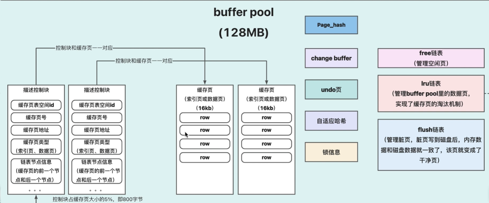
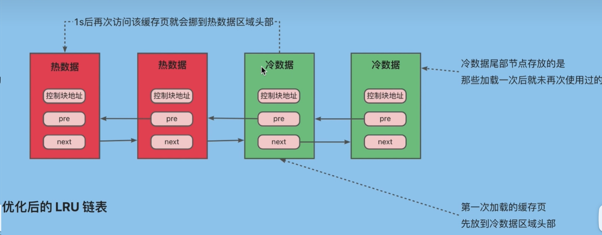
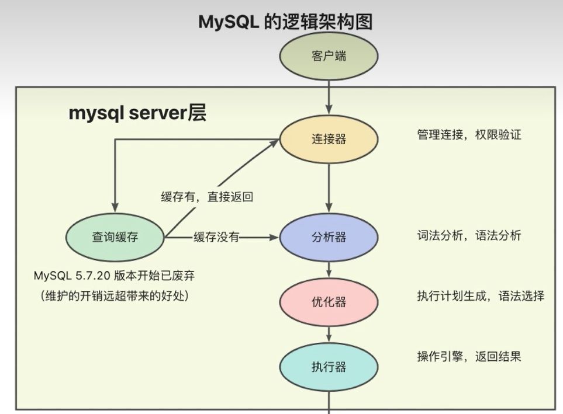
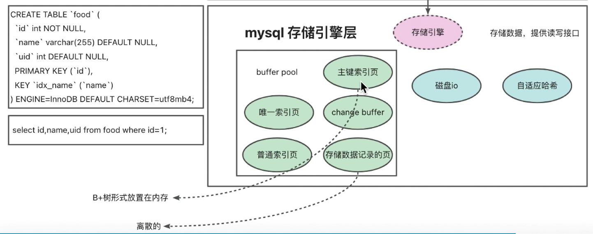
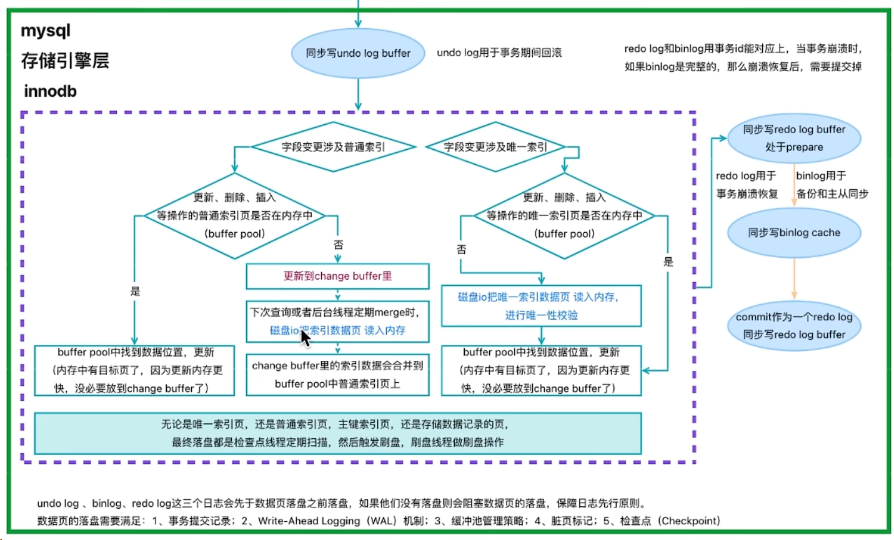
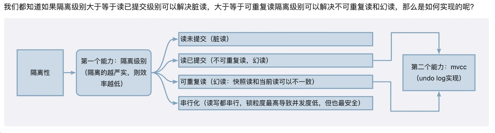

## BiliBili
<iframe width="100%" height="468" src="//player.bilibili.com/player.html?bvid=BV15z421o7Up" scrolling="no" border="0" frameborder="no" framespacing="0" allowfullscreen="true"></iframe>

## 前置知识

### buffer pool
> innoDB 存储引擎的核心组件，用于缓存数据库中的数据和索引，减少对磁盘的访问次数，提升数据库的**读**性能。

- 如何解决预读失效和缓冲池污染的问题？
    - 将缓冲池分为冷热数据区域，冷数据区域用于缓存最近最少使用的数据，热数据区域用于缓存最近频繁使用的数据。
    - 必须在冷数据区域中停留一段时间（避免大量查询导致的缓冲区污染，如索引失效情况下的全表查询），确保热数据区域中的数据是最近频繁使用的。

### change buffer
> 用于缓存对非唯一索引的修改操作，减少对磁盘的写操作，提升数据库的**写**性能。
- 为什么需要change buffer？
    - 非唯一二级索引的 B + 树叶子节点是离散分布的（比如按 age 建的非唯一索引，age=20 的记录可能分散在多个数据页中）；
    - 当执行 UPDATE user SET age=30 WHERE id=1 时，若 age 的索引页不在内存（buffer pool）中，InnoDB 必须：从磁盘加载该索引页到内存（随机读 IO，速度极慢，是磁盘 IO 中耗时最高的类型）；
    - 修改内存中的索引页；后续通过刷脏（flush）将修改写入磁盘（随机写 IO）。高并发更新场景下，大量随机 IO 会直接拖垮数据库性能。
- change buffer 的核心思想
    - change buffer 本质是 “延迟更新 + 批量合并” 的优化策略
- change buffer 什么时候合并？
    - 普通索引被读取到内存（buffer pool）中时，会触发 change buffer 的合并操作。（查询请求）
    - change buffer 占用空间达到阈值时，会触发 change buffer 的合并操作。（内存空间不足）
    - 系统空闲时，会触发 change buffer 的合并操作。（定时任务）
- 为什么change buffer只适用于普通索引？
    - change buffer 是延迟更新 + 批量合并的优化策略，而唯一索引的更新操作必须保证唯一性，因此不能延迟更新，不能批量合并。innodb会进行唯一性检查。
- change buffer 的使用场景
    - 数据库大多数是普通索引
    - 数据库写多读少，且更新数据后，查询请求不会立即访问到该数据

## Sql 执行过程
### Mysql的逻辑架构
- Server层

- 存储引擎层

### DML（插入、更新、删除）SQL语句是如何执行的

#### ex1：update T set c = c + 1 where id = 2 执行器和存储引擎都做了什么？
1. 执行器先调用存储引擎的 read 接口，读取 id=2 的这一行数据。（缓存有就直接返回，缓存没有就会进行磁盘IO）
2. 执行器将这个值+1，调用存储引擎接口写入新数据
3. 在更新数据到内存中时，会写入undo log，用于回滚操作。（用于记录存储之前的值）
4. 存储引擎更新数据到内存中，记录redo log，用于恢复操作。（用于记录存储之后的值）
5. 执行器完成更新操作，生成bin log，并将其写入binlog cache中，后台由binlog dump线程将其写入binlog文件中。
6. 执行器提交存储引擎的提交事务接口。

### MVCC是如何实现事务隔离的
