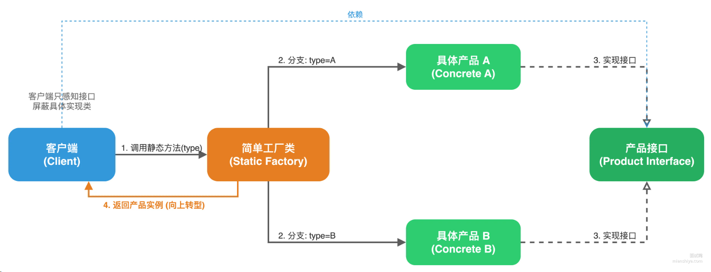
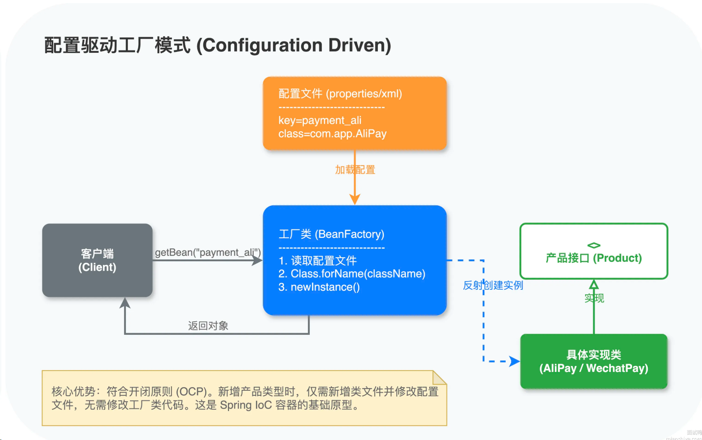

## 谈谈你了解的最常见的几种设计模式，说说他们的应用场景

### 1. 单例模式
> 全局只需要用到一个实例的时候。比如数据库连接池；配置中心的客户端


### 2. 工厂模式

### 3. 策略模式
> 支付场景举例：比如支付宝、微信支付、银联支付等，每个渠道的支付逻辑不一样，天然就是不同的策略。定义一个PayService接口，然后不同的支付渠道实现这个接口，客户端只需要调用PayService接口即可，不需要知道具体是哪个支付渠道。

- 策略模式消除if-else

### 4. 模板方法模式
> 模板方法模式是一种行为型设计模式，它定义了一个算法的骨架，而将一些步骤延迟到子类中。子类可以不改变算法的骨架即可重定义该算法的某些步骤。模板方法模式通常用于在算法的实现中，有一些步骤是通用的，而有一些步骤是可变的。


## 什么是责任链模式？一般用在什么场景？
> 责任链模式是一种行为型设计模式，它定义了一个请求处理链，每个对象都有机会处理这个请求。如果一个对象不能处理这个请求，它会把请求传递给下一个对象。直到有一个对象处理了这个请求为止。
典型场景：
审批流程：比如请假申请，需要先由组长审批，再由经理审批，最后由总监审批
```java
// 抽象处理器
abstract class Handler {
    protected Handler next;

    public Handler setNext(Handler next) {
        this.next = next;
        return next; // 返回next方便链式调用
    }

    public abstract void handle(int amount);
}

// 组长：500以内
class LeaderHandler extends Handler {
    public void handle(int amount) {
        if (amount <= 500) {
            System.out.println("组长审批通过：" + amount);
        } else if (next != null) {
            next.handle(amount);
        }
    }
}

// 经理：500-2000
class ManagerHandler extends Handler {
    public void handle(int amount) {
        if (amount <= 2000) {
            System.out.println("经理审批通过：" + amount);
        } else if (next != null) {
            next.handle(amount);
        }
    }
}

// 使用
Handler chain = new LeaderHandler();
chain.setNext(new ManagerHandler()).setNext(new DirectorHandler());
chain.handle(1500); // 经理审批通过：1500

```

### 责任链的两种实现形式
1. 独占处理（纯责任链）
请求只能被链上的一个节点处理，处理完成后就结束。
2. 层层过滤（不纯责任链）
请求会经过链上的多个节点，每个节点都可以做点事情。比如Servelet的FilterChain。

## 什么是模板方法模式？一般用在什么场景？
> 模板方法模式是一种行为设计模式，核心思想是在一个抽象类中定义一个算法的骨架，而将一些步骤延迟到子类中。子类可以不改变算法的骨架即可重定义该算法的某些步骤。
模板方法模式通常用于在算法的实现中，有一些步骤是通用的，而有一些步骤是可变的。

```java
// 抽象类
abstract class DataProcessor {
    // 模板方法，定死执行顺序
    public final void process() {
        readData();
        processData();
        writeData();
    }

    protected abstract void readData();    // 子类必须实现
    protected abstract void processData(); // 子类必须实现

    protected void writeData() {           // 默认实现，子类可覆盖
        System.out.println("Writing data to output.");
    }
}

// CSV 处理器
class CSVDataProcessor extends DataProcessor {
    @Override
    protected void readData() {
        System.out.println("Reading data from CSV file.");
    }

    @Override
    protected void processData() {
        System.out.println("Processing CSV data.");
    }
}

// JSON 处理器
class JSONDataProcessor extends DataProcessor {
    @Override
    protected void readData() {
        System.out.println("Reading data from JSON file.");
    }

    @Override
    protected void processData() {
        System.out.println("Processing JSON data.");
    }
}


## 什么是观察者模式？一般用在什么场景？
> 观察者模式是一种设计模式，它定义了对象之间的一对多依赖关系，当一个对象的状态发生变化时，所有依赖于它的对象都会得到通知并自动更新。

整个模式由四个角色组成：
1. Subject（主题）：被观察的对象，维护观察者列表，提供添加、删除观察者的方法，以及通知观察者的方法。
2. Observer（观察者）：依赖于主题的对象，实现update方法，用于接收主题的通知。
3. ConcreteSubject（具体主题）：具体实现主题接口，维护观察者列表并实现通知观察者的方法。
4. ConcreteObserver（具体观察者）：具体实现观察者接口，实现update方法，用于处理主题的通知。


### 典型的应用场景
1. 事件驱动系统：比如GUI系统中的事件处理，数据库系统中的触发器。
2. 数据发布订阅系统：比如消息队列中的消息发布订阅。
3. 状态机：比如状态机中的状态变化。


## 什么是代理模式？一般用在什么场景？
> 代理模式是一种结构性设计模式，核心思想是在不改变原始对象的前提下，通过一个代理对象来控制原始对象的访问。

代理模式的主要使用场景：
1. 远程代理：比如网络代理，数据库代理。
2. 虚拟代理：比如图片代理，文件代理。
3. 保护代理：比如权限代理，缓存代理。

```java
// 共同接口
interface UserService {
    void save();
}

// 真实类
class UserServiceImpl implements UserService {
    public void save() {
        System.out.println("保存用户");
    }
}

// 代理类
class UserServiceProxy implements UserService {
    private UserService target; // 真实对象
    
    public UserServiceProxy(UserService target) {
        this.target = target;
    }

    public void save() {
        System.out.println("开启事务"); // 增强
        target.save(); // 调用真实方法
        System.out.println("提交事务"); // 增强
    }
}
```

### 两种代理模式
1. 静态代理：在编译时就已经确定了代理类。
2. 动态代理：在运行时动态生成代理类，比如Java的动态代理机制。
```java
public class LogHandler implements InvocationHandler {
    private Object target;

    public LogHandler(Object target) {
        this.target = target;
    }

    @Override
    public Object invoke(Object proxy, Method method, Object[] args) throws Throwable {
        System.out.println("方法 " + method.getName() + " 开始执行");
        Object result = method.invoke(target, args);  // 反射调用真实对象
        System.out.println("方法 " + method.getName() + " 执行结束");
        return result;
    }
}

// 创建代理对象
UserService proxy = (UserService) Proxy.newProxyInstance(
    UserService.class.getClassLoader(),
    new Class[]{UserService.class},
    new LogHandler(new UserServiceImpl())
);
proxy.save(user);  // 走代理

```

## 简述简单工厂模式的工作原理。
简单工厂模式的核心思想是把对象创建逻辑集中到一个工厂类中，调用方法只需要告诉工厂类需要创建的对象类型，工厂类会根据类型创建对应的对象。


```java
// 产品接口
public interface Database {
    void connect();
}

// 具体产品
public class MySQL implements Database {
    public void connect() {
        System.out.println("连接 MySQL 数据库");
    }
}

public class PostgreSQL implements Database {
    public void connect() {
        System.out.println("连接 PostgreSQL 数据库");
    }
}

// 简单工厂
public class DatabaseFactory {
    public static Database createDatabase(String type) {
        switch (type) {
            case "mysql":
                return new MySQL();
            case "postgresql":
                return new PostgreSQL();
            default:
                throw new IllegalArgumentException("不支持的数据库类型: " + type);
        }
    }
}

// 客户端使用
Database db = DatabaseFactory.createDatabase("mysql");
db.connect();

```

### 存在的问题
1. 如果需要新增产品，需要修改工厂类，违反开闭原则。
2. 工厂类职责过重，违反单一职责原则。
### 解决方案
1. 使用配置驱动工厂模式

```java
public class ConfigurableFactory {
    private static Map<String, String> typeMapping = new HashMap<>();

    static {
        // 从配置文件加载映射关系
        typeMapping.put("mysql", "com.example.MySQL");
        typeMapping.put("postgresql", "com.example.PostgreSQL");
    }

    public static Database create(String type) {
        String className = typeMapping.get(type);
        return (Database) Class.forName(className).newInstance();
    }
}

```

### 简单工厂和工厂方法的区别是什么？
简单工厂把所有工厂创建逻辑堆在一个类中，新增产品就要改工厂代码。
工厂方法把创建逻辑分散到各个子类工厂中，新增产品只需要加一个新的子类工厂，符合开闭原则，但是代价是子类的数量会膨胀，每新增一个产品就要多一个工厂类，如果产品类型不多，工厂模式就够用了。

### 工厂模式和抽象工厂模式的区别是什么？

这两个都是创建型设计模式，核心目的都是解耦对象创建（不用自己 new 对象，让工厂帮你创建），区别主要在于产品规模、工厂职责、使用场景。
核心区别：
- 工厂模式：生产单一产品（一个工厂只造一种东西）
- 抽象工厂模式：生产产品族（一个工厂造一整套相关联的东西）

1. 工厂模式 = 单品类工厂
你只需要一种东西，比如：华为工厂 → 只造华为手机；苹果工厂 → 只造苹果手机。一个工厂，只干一件事。
2. 抽象工厂模式 = 成套设备工厂你需要一整套配套的东西，比如：苹果工厂 → 造苹果手机 + 苹果耳机 + 苹果充电器；华为工厂 → 造华为手机 + 华为耳机 + 华为充电器。一个工厂，造一整套产品，且产品之间必须配套。

### 单例模式有哪几种实现，如何保证线程安全？
单例模式（Singleton）是创建型设计模式，核心目的是：保证一个类在整个程序中只有一个实例，并提供全局访问点。

- 饿汉式单例
在类加载时就创建好实例，线程安全。缺点是不管用不用都会占用内存。
```java
public class Singleton {
    private static final Singleton instance = new Singleton();
    private Singleton() {}
    public static Singleton getInstance() {
        return instance;
    }
}
```
- 懒汉式
在第一次使用时才创建实例，线程不安全，需要加锁。
```java
public class Singleton {
    private static Singleton instance;
    private Singleton() {}
    public static synchronized Singleton getInstance() {
        if (instance == null) {
            instance = new Singleton();
        }
        return instance;
    }
}
```
- 双重检查锁
在懒汉式基础上加一层判断，减少锁的粒度，提高性能，线程安全。
```java
public class Singleton4 {
    // volatile：禁止指令重排，保证多线程可见性
    private static volatile Singleton4 instance;

    private Singleton4() {}

    public static Singleton4 getInstance() {
        // 第一次检查：不加锁，提高效率
        if (instance == null) {
            // 加锁：保证只有一个线程创建实例
            synchronized (Singleton4.class) {
                // 第二次检查：防止多线程同时进入第一层判断
                if (instance == null) {
                    instance = new Singleton4();
                }
            }
        }
        return instance;
    }
}
```
- 静态内部类
利用静态内部类实现懒加载，线程安全。
```java
public class Singleton {
    private Singleton() {}
    private static class SingletonHolder {
        private static final Singleton INSTANCE = new Singleton();
    }
    public static Singleton getInstance() {
        return SingletonHolder.INSTANCE;
    }
}
```
- 枚举
枚举类型是线程安全的，并且只会加载一次，实现简单。
```java
public enum Singleton {
    INSTANCE;
    public void doSomething() {
        System.out.println("doSomething");
    }
}
```
