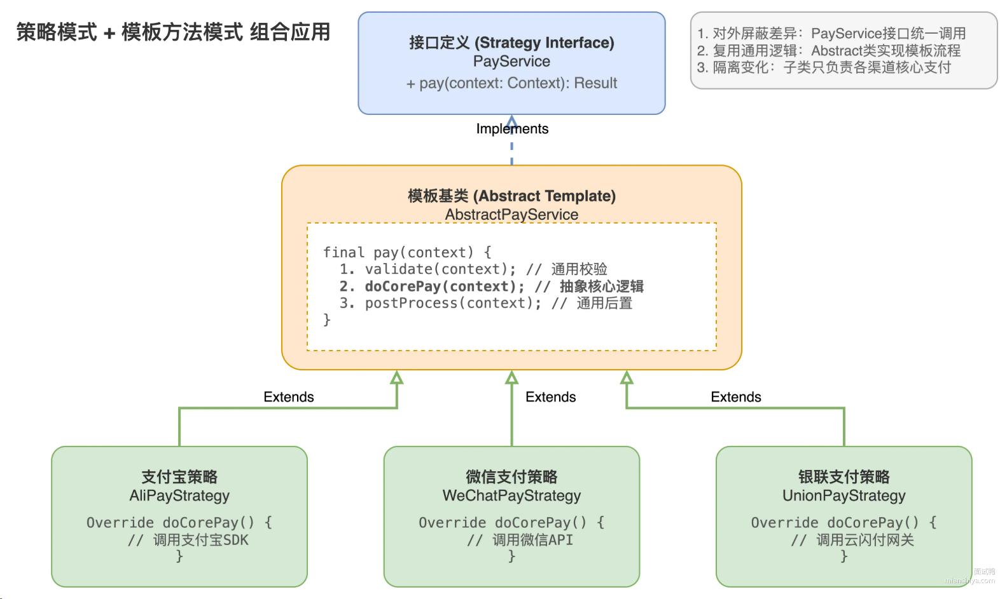
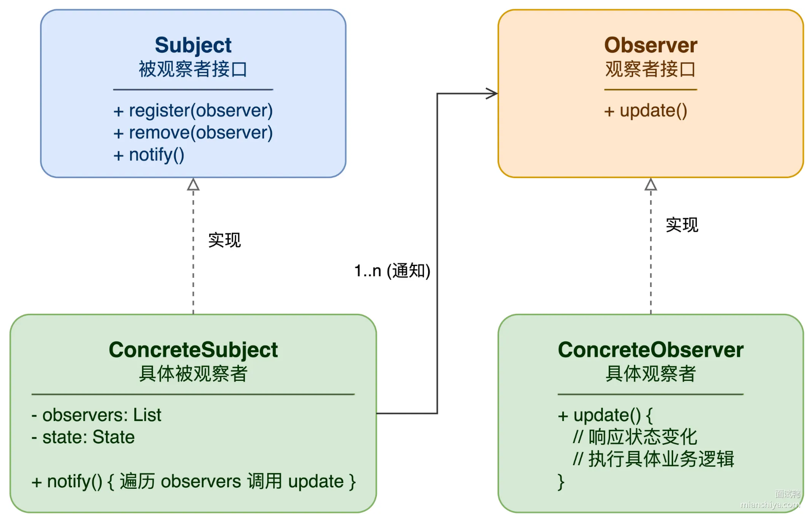

## 谈谈你了解的最常见的几种设计模式，说说他们的应用场景

### 1. 单例模式
> 全局只需要用到一个实例的时候。比如数据库连接池；配置中心的客户端


### 2. 工厂模式

### 3. 策略模式
> 支付场景举例：比如支付宝、微信支付、银联支付等，每个渠道的支付逻辑不一样，天然就是不同的策略。定义一个PayService接口，然后不同的支付渠道实现这个接口，客户端只需要调用PayService接口即可，不需要知道具体是哪个支付渠道。

- 策略模式消除if-else

### 4. 模板方法模式
> 模板方法模式是一种行为型设计模式，它定义了一个算法的骨架，而将一些步骤延迟到子类中。子类可以不改变算法的骨架即可重定义该算法的某些步骤。模板方法模式通常用于在算法的实现中，有一些步骤是通用的，而有一些步骤是可变的。




## 什么是责任链模式？一般用在什么场景？
> 责任链模式是一种行为型设计模式，它定义了一个请求处理链，每个对象都有机会处理这个请求。如果一个对象不能处理这个请求，它会把请求传递给下一个对象。直到有一个对象处理了这个请求为止。
典型场景：
审批流程：比如请假申请，需要先由组长审批，再由经理审批，最后由总监审批
```java
// 抽象处理器
abstract class Handler {
    protected Handler next;

    public Handler setNext(Handler next) {
        this.next = next;
        return next; // 返回next方便链式调用
    }

    public abstract void handle(int amount);
}

// 组长：500以内
class LeaderHandler extends Handler {
    public void handle(int amount) {
        if (amount <= 500) {
            System.out.println("组长审批通过：" + amount);
        } else if (next != null) {
            next.handle(amount);
        }
    }
}

// 经理：500-2000
class ManagerHandler extends Handler {
    public void handle(int amount) {
        if (amount <= 2000) {
            System.out.println("经理审批通过：" + amount);
        } else if (next != null) {
            next.handle(amount);
        }
    }
}

// 使用
Handler chain = new LeaderHandler();
chain.setNext(new ManagerHandler()).setNext(new DirectorHandler());
chain.handle(1500); // 经理审批通过：1500

```

### 责任链的两种实现形式
1. 独占处理（纯责任链）
请求只能被链上的一个节点处理，处理完成后就结束。
2. 层层过滤（不纯责任链）
请求会经过链上的多个节点，每个节点都可以做点事情。比如Servelet的FilterChain。

## 什么是模板方法模式？一般用在什么场景？
> 模板方法模式是一种行为设计模式，核心思想是在一个抽象类中定义一个算法的骨架，而将一些步骤延迟到子类中。子类可以不改变算法的骨架即可重定义该算法的某些步骤。
模板方法模式通常用于在算法的实现中，有一些步骤是通用的，而有一些步骤是可变的。

```java
// 抽象类
abstract class DataProcessor {
    // 模板方法，定死执行顺序
    public final void process() {
        readData();
        processData();
        writeData();
    }

    protected abstract void readData();    // 子类必须实现
    protected abstract void processData(); // 子类必须实现

    protected void writeData() {           // 默认实现，子类可覆盖
        System.out.println("Writing data to output.");
    }
}

// CSV 处理器
class CSVDataProcessor extends DataProcessor {
    @Override
    protected void readData() {
        System.out.println("Reading data from CSV file.");
    }

    @Override
    protected void processData() {
        System.out.println("Processing CSV data.");
    }
}

// JSON 处理器
class JSONDataProcessor extends DataProcessor {
    @Override
    protected void readData() {
        System.out.println("Reading data from JSON file.");
    }

    @Override
    protected void processData() {
        System.out.println("Processing JSON data.");
    }
}


## 什么是观察者模式？一般用在什么场景？
> 观察者模式是一种设计模式，它定义了对象之间的一对多依赖关系，当一个对象的状态发生变化时，所有依赖于它的对象都会得到通知并自动更新。

整个模式由四个角色组成：
1. Subject（主题）：被观察的对象，维护观察者列表，提供添加、删除观察者的方法，以及通知观察者的方法。
2. Observer（观察者）：依赖于主题的对象，实现update方法，用于接收主题的通知。
3. ConcreteSubject（具体主题）：具体实现主题接口，维护观察者列表并实现通知观察者的方法。
4. ConcreteObserver（具体观察者）：具体实现观察者接口，实现update方法，用于处理主题的通知。


### 典型的应用场景
1. 事件驱动系统：比如GUI系统中的事件处理，数据库系统中的触发器。
2. 数据发布订阅系统：比如消息队列中的消息发布订阅。
3. 状态机：比如状态机中的状态变化。


## 什么是代理模式？一般用在什么场景？
