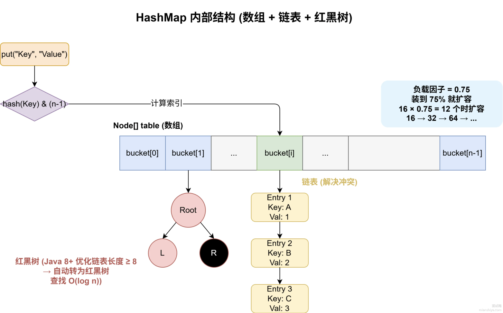

# HashMap的原理
1. 怎么存？
    - 先计算key的hashCode值（"apple".hashCode()=97099），后进行哈希扰动（(key == null) ? 0 : (h = key.hashCode()) ^ (h >>> 16)）,其目的在于让让高 16 位和低 16 位混合，保证高位也能影响最终结果，让哈希结果更平均
    - 再对hashCode值进行取模运算，得到数组下标（hash & (n-1)），其中n是2的幂次，等价于 hash % n
2. 冲突了怎么办？
    - 链表串联
    - JDK8做了优化，如果超过8个则用红黑树串起来
3. 扩容机制
    - 数组长度是有限的，存多了会拥挤，hashmap有个负载因子（默认0.75），当存的元素超过数组长度*负载因子时，就会触发扩容。然后把所有的数据重新放到新数组中，这个操作叫rehash，比较耗费性能，最好初始时预估好容量。

---
# HashMap线程安全性问题

1. 数据覆盖
    > HashMap 的 put 操作不是原子性的，核心步骤（计算下标→检查桶位→插入节点）被拆分成了多个步骤，多线程切换执行时会 “插队”：
    - 多线程同时执行 put 操作时，可能导致同一个 key 对应的 value 被错误覆盖。
2. 扩容时的死循环（JDK 1.7 经典问题）
    - JDK 1.7 中 HashMap 扩容（resize）时采用 “头插法” 迁移链表节点，多线程扩容会导致链表成环，后续调用 get 方法时会陷入死循环（CPU 100%）。
3. 数据丢失 / 查询结果不一致

## 为什么不设计成线程安全的？
> HashMap 的设计目标是极致的单线程性能，如果加入锁等线程安全机制，会大幅降低执行效率（比如锁竞争、内存屏障等）

## 如何解决？
> 使用ConcurrentHashMap，它是HashMap的线程安全版本，内部采用了分段锁（Segment）机制，每个Segment都是一个独立的HashMap，不同线程可以并发操作不同的Segment，从而提高了并发性能。

## JDK1.7和JDK1.8的ConcurrentHashMap区别
两个版本的核心区别在于锁的力度。

### JDK1.7
采用分段锁设计，把整个数组分成16个Segment，每个Segment里都是一个独立的hashmap加一个ReentrantLock（可重入锁），不同线程可以并发操作不同的Segment，从而提高了并发性能。
### JDK1.8
> 取消了Segment，采用了CAS+Synchronized（乐观锁+悲观锁）的机制。锁力度细化到了每个槽位，插入时先尝试CAS无锁插入到对应位置，真正冲突了才Sysnchronized加锁。
