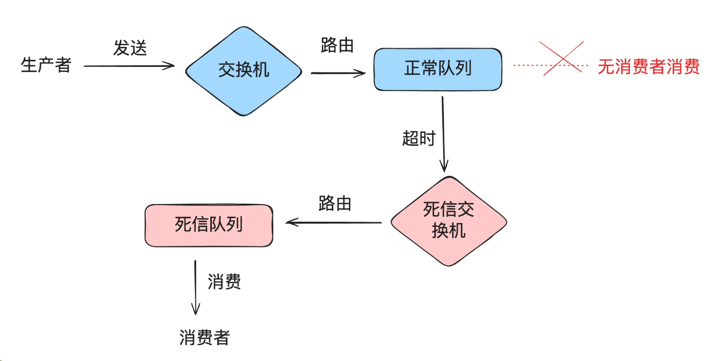
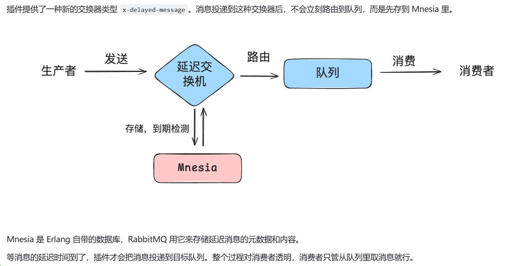
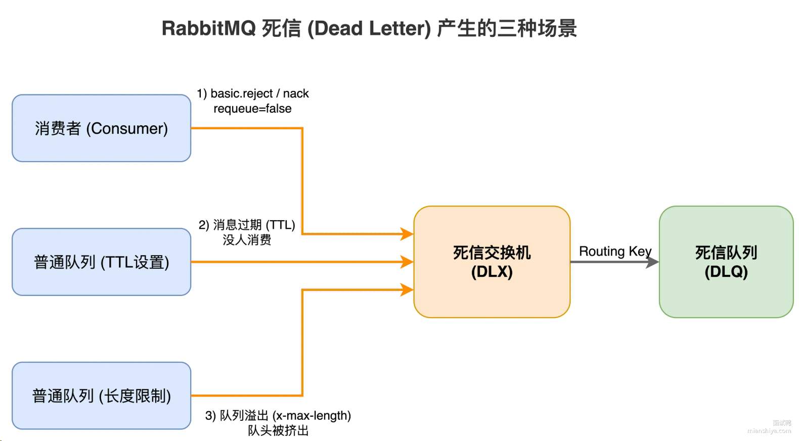
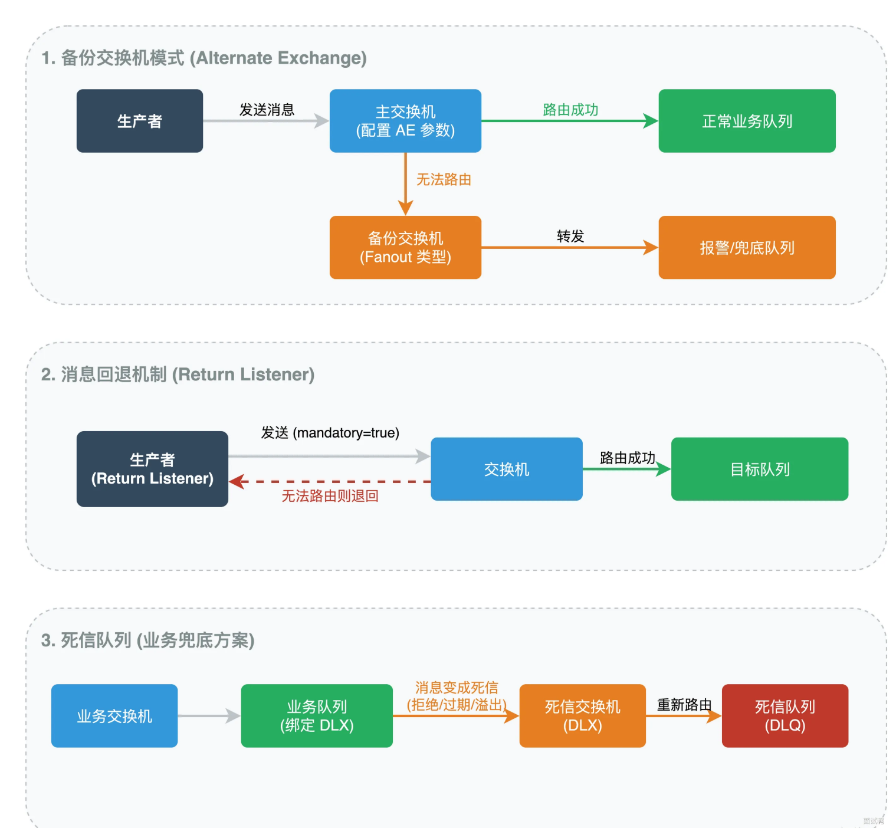
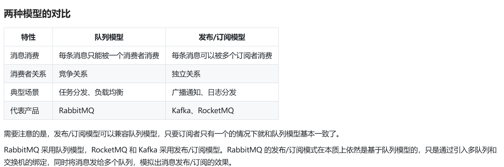

## RabbitMQ是如何实现延迟队列的？
> 延迟队列：延迟队列 = 存 “未来才执行” 的任务的队列，到指定时间才会被消费处理。

 **TTL（消息存活时间）+DLX（死信交换机）**
 

### 存在的问题
> 消息阻塞：比如三个任务需要延迟10s，5s，1s，实际上1s的任务需要先执行，但是由于队列先进先出的特性，需要等待签名的任务执行后才能执行1s的任务。

### 解决方案
- 如果延迟时间就那么几个挡位，可以每挡设置一个延迟队列
- 使用延迟消息插件

### 延迟消息插件的实现原理

## RabbitMQ中的消息什么时候会进入DLX？
1. 消息被消费者拒绝
2. 队列消息存活时间超过TTL
3. 队列满了装不下了

## RabbitMQ中无法路由的消息会去哪儿？
> 生产者把消息发给 RabbitMQ，但 RabbitMQ 找不到任何符合条件的队列来存放这条消息，这条消息就成了 “无法路由的消息”。

默认情况下，无法路由的消息会被丢弃，不会有任何提示。
但是在生产环境中，消息不能够悄悄消失，一般有三种方式来处理这种情况：
1. 备份交换机
2. 消息回退机制
3. 死信队列

## 消息队列的模型有哪些？
1. 队列模型（点对点模型）

2. 发布订阅模型（多对多模型）

